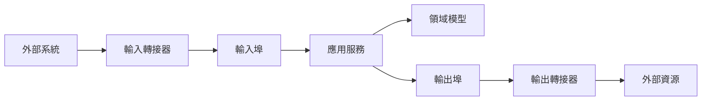
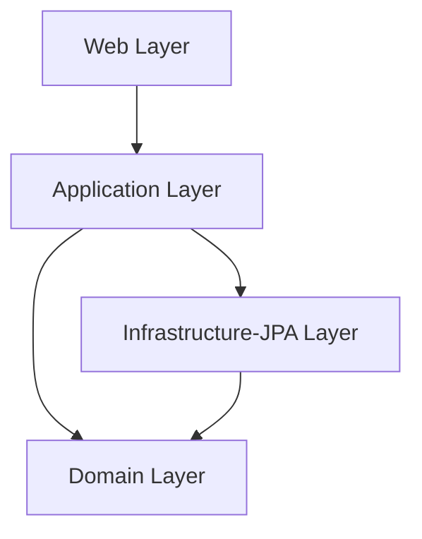

# Hex Spring Modular Example

這是一個基於 **Spring Boot** 的六邏輯層（Hexagonal Architecture）範例專案，使用 **JPA** 與 **H2 In-Memory Database**，實作了簡單的 `Order` CRUD 功能，並模組化拆分為多個 Maven module。

## 專案結構

```
hex-spring-modular/
├── domain                 # 核心領域邏輯與實體
├── application            # 用例與服務層
├── infrastructure-jpa     # JPA 資料庫實作
├── web                    # REST API 入口
└── pom.xml                # 父 POM
```

## 系統功能

- 建立訂單（POST /api/orders）
- 查詢全部訂單（GET /api/orders）
- 依 ID 查詢訂單（GET /api/orders/{id}）
- H2 Memory DB 儲存（啟動時自動建立表格並插入測試資料）

## 建置與啟動

```bash
# 1. 編譯與打包所有模組
mvn clean install

# 2. 啟動 Web 模組
mvn -pl web spring-boot:run
```

啟動後，Tomcat 會在 **<http://localhost:8080/>** 運行。

---

## 測試 API

啟動後可以用以下方式測試：

### 1. 瀏覽器查看

```
http://localhost:8080/api/orders
```

**範例回應：**

```json
[
  {
    "id": 1,
    "customerName": "Alice",
    "totalAmount": 100.0
  },
  {
    "id": 2,
    "customerName": "Bob",
    "totalAmount": 50.5
  }
]
```

### 2. 取得全部訂單

```powershell
curl http://localhost:8080/api/orders
```

### 3. 新增一筆訂單

```powershell
curl -X POST http://localhost:8080/api/orders `
     -H "Content-Type: application/json" `
     -d '{"customerName":"Charlie","totalAmount":12.34}'
```

**範例回應：**

```json
{
  "id": 3,
  "customerName": "Charlie",
  "totalAmount": 12.34
}
```

### 4. 查詢單筆訂單

（將 `{id}` 換成新增後回傳的 id）

```powershell
curl http://localhost:8080/api/orders/{id}
```

**範例回應：**

```json
{
  "id": 1,
  "customerName": "Alice",
  "totalAmount": 100.0
}
```

---

## 使用 H2 Console 查看資料

1. 開啟：

```
http://localhost:8080/h2-console
```

2. 設定連線資訊：

```
JDBC URL: jdbc:h2:mem:testdb
User: sa
Password: (留空)
```

3. 點擊 **Connect** 後即可查看 `orders` 資料表內容。

---

## 預設測試資料

系統啟動時會自動插入兩筆測試資料：

| id  | customer_name | total_amount |
|-----|--------------|--------------|
| 1   | Alice        | 100.00       |
| 2   | Bob          | 50.50        |

---

## 開發環境需求

- JDK 21+
- Maven 3.9+
- Spring Boot 3.x

### 什麼是六邊形架構？

六邊形架構（Hexagonal / **Ports and Adapters**）強調 **核心領域** 與 I/O 技術（Web、資料庫、訊息系統）的**解耦**。  
外部技術透過 **Adapter（轉接器）** 連到由 **Port（介面）** 定義的邊界。

### 核心概念

- **核心（Domain）**：商業規則、領域模型、用例；**不依賴**框架。  
- **Ports（介面）**：定義邊界。  
  - **Inbound Port（輸入埠）**：外部呼入方式（用例）。  
  - **Outbound Port（輸出埠）**：核心向外部請求的能力（如持久化）。  
- **Adapters（轉接器）**：將實際技術對接到 Port。  
  - **Inbound Adapter**：REST Controller、CLI、訊息消費者。  
  - **Outbound Adapter**：JPA Adapter、HTTP Client、Email 寄送。

### Mermaid 圖（Ports & Adapters）



### 專案對應

- **domain** → 核心領域與 Port（`Order`、`OrderRepository`）  
- **application** → 用例/服務（`OrderService`）  
- **web** → 輸入轉接器（REST Controller）  
- **infrastructure-jpa** → 輸出轉接器（JPA Entity/Repository + Adapter 實作）

### 為什麼要用

- **可測試**：不需啟 DB 或 Web 也能測核心。  
- **可替換**：更換資料庫或傳輸層不動核心。  
- **可維護**：商務與基礎設施清楚分離。

### 測試策略

- **domain**：純單元測試。  
- **application**：以 stub/mock 測服務與用例。  
- **infrastructure-jpa**：`@DataJpaTest` 切片測試 adapter。  
- **web**：`@WebMvcTest` 與 `@SpringBootTest` 整合測試。

### 常見雷點

- 在 domain 夾雜框架註解。  
- Controller 直接依賴 JPA Entity 而非 domain 類型。  
- 跳過 Port，從 Controller 直呼 Adapter。

### 關係圖
1. Domain
定位：整個系統的「核心」，不依賴任何框架、資料庫、UI。

內容：

Entity（領域實體，例如 Order）

Value Object（值物件，例如 Money）

Domain Service（純業務邏輯服務）

Port（介面）— 定義系統需要跟外部互動的能力（例如 OrderRepository）

不能做的事：

不能直接 import Spring、JPA、HTTP 相關的套件

不跟資料庫、API 直接打交道

依賴方向：❌ 不依賴其他 module（最核心）

2. Application
定位：負責 用例（Use Case） 與 流程控制。

內容：

Application Service（應用服務，例如 OrderService）

實作 domain 定義的 inbound port（例如 CreateOrderUseCase）

特點：

不處理資料儲存細節

不管 HTTP、UI 格式，只管「執行用例」並回傳 domain 資料

依賴方向：

依賴 domain（呼叫 domain 物件與介面）

不依賴 infrastructure-jpa 或 web

3. Infrastructure-JPA
定位：負責實作 domain 定義的 Outbound Port，也就是外部基礎設施（資料庫、API、訊息佇列等）的存取。

內容：

JPA Entity（資料庫對應實體）

Spring Data JPA Repository

Adapter（例如 OrderRepositoryAdapter）實作 OrderRepository 介面

特點：

這裡才會 import Spring Data JPA、Hibernate

把 DB 查詢結果轉成 Domain Object

依賴方向：

依賴 domain（因為要實作 domain 定義的 repository 介面）

不依賴 application 或 web

4. Web
定位：負責 輸入/輸出轉換，提供 API 給外界呼叫。

內容：

Controller（HTTP 入口點）

DTO（輸入輸出資料格式）

Request / Response mapping

特點：

Controller 接收 HTTP Request → 呼叫 application 的用例 → 把結果轉成 JSON Response

依賴方向：

依賴 application（呼叫服務）

不直接依賴 infrastructure-jpa（要透過 application 執行）

不能直接操作 DB Entity


